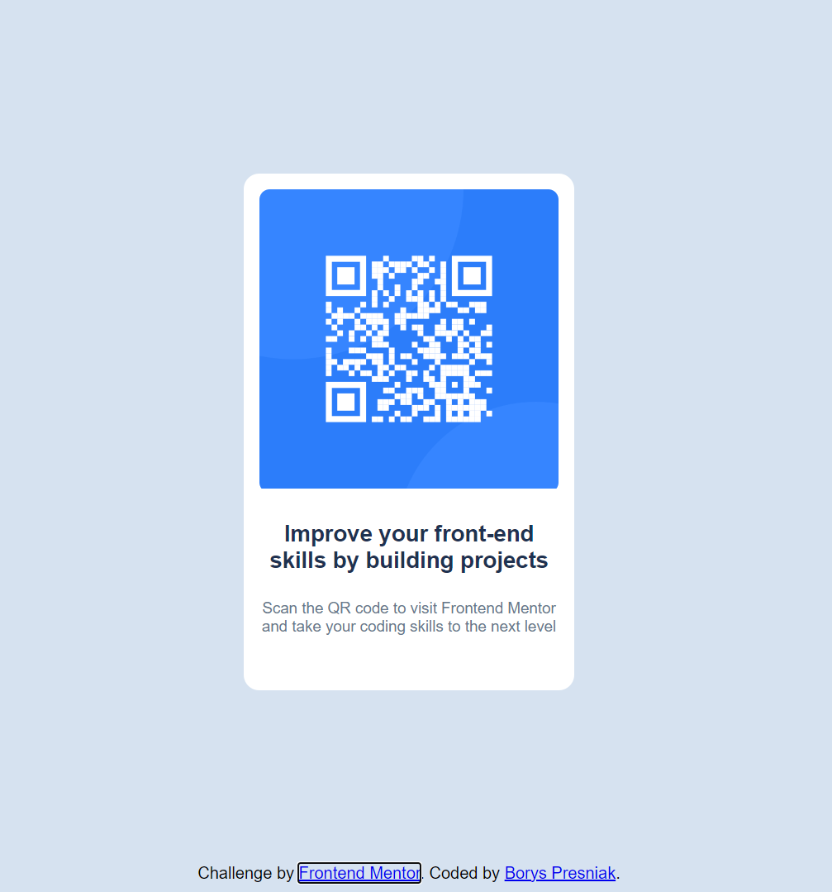

# Frontend Mentor - QR code component solution

This is a solution to the [QR code component challenge on Frontend Mentor](https://www.frontendmentor.io/challenges/qr-code-component-iux_sIO_H). Frontend Mentor challenges help you improve your coding skills by building realistic projects. 

## Table of contents

- [Overview](#overview)
  - [Screenshot](#screenshot)
  - [Links](#links)
- [My process](#my-process)
  - [Built with](#built-with)
  - [What I learned](#what-i-learned)
  - [Continued development](#continued-development)
  - [Useful resources](#useful-resources)
- [Author](#author)
- [Acknowledgments](#acknowledgments)

**Note: Delete this note and update the table of contents based on what sections you keep.**

## Overview

### Screenshot

Add a screenshot of your solution. The easiest way to do this is to use Firefox to view your project, right-click the page and select "Take a Screenshot". You can choose either a full-height screenshot or a cropped one based on how long the page is. If it's very long, it might be best to crop it.

Alternatively, you can use a tool like [FireShot](https://getfireshot.com/) to take the screenshot. FireShot has a free option, so you don't need to purchase it. 

Then crop/optimize/edit your image however you like, add it to your project, and update the file path in the image above.

**Note: Delete this note and the paragraphs above when you add your screenshot. If you prefer not to add a screenshot, feel free to remove this entire section.**

### Links

- Solution URL: https://github.com/BorysPresn/qr-code-component
- Live Site URL: https://boryspresn.github.io/qr-code-component/

## My process

### Built with

- Semantic HTML5 markup
- CSS custom properties
- Flexbox
- Mobile-first workflow

**Note: These are just examples. Delete this note and replace the list above with your own choices**

### What I learned

Through this project, I learned how to effectively use Flexbox to center content both vertically and horizontally within a container. Additionally, I practiced creating a responsive layout that adapts to various screen sizes. Key takeaways include:
 - Using flex to manage the layout and ensure that elements are properly aligned and centered.
 - Implementing a mobile-first approach to ensure that the design works well on both mobile and desktop screens.

**Note: Delete this note and the content within this section and replace with your own learnings.**

### Continued development

In future projects, I plan to:

 - Explore CSS Grid for more complex layouts and alignments.
 - Improve my skills with JavaScript to add interactive features to my components.
 - Continue learning about responsive design and accessibility best practices.

**Note: Delete this note and the content within this section and replace with your own plans for continued development.**

### Useful resources

MDN Web Docs - Flexbox - Useful documentation for learning and referencing Flexbox properties.

**Note: Delete this note and replace the list above with resources that helped you during the challenge. These could come in handy for anyone viewing your solution or for yourself when you look back on this project in the future.**

## Author

**Note: Delete this note and add/remove/edit lines above based on what links you'd like to share.**

## Acknowledgments

I’d like to thank Frontend Mentor for providing such a well-defined challenge. Special thanks to the community for their feedback and support, which helped me refine my solution.

**Note: Delete this note and edit this section's content as necessary. If you completed this challenge by yourself, feel free to delete this section entirely.**
